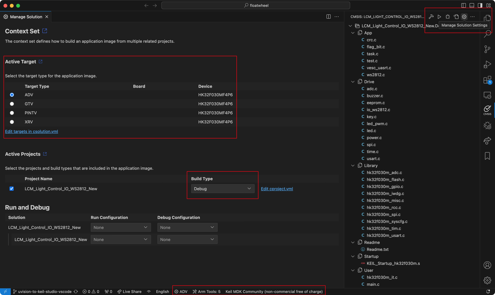

# Floatwheel LCM Firmware

## Setting up the project

### Using VSCode

1. Install [Visual Studio Code](https://code.visualstudio.com)
2. Type 'code' to run it
3. Open `floatwheel` folder in Visual Studio Code
4. Install [Keil Studio Pack](https://marketplace.visualstudio.com/items?itemName=Arm.keil-studio-pack) extension [^1]
5. Wait for Arm Tools to finish downloading / installing [^2][^3]
6. Activate Keil MDK Community license when prompted
7. Open a terminal in Visual Studio Code
8. Input `cpackget add LCM/HKMicroChip.HK32F030xMxx_DFP.1.0.17.pack` and press Enter/Return [^4]
9. Use CMSIS tab to select target device and build / debug [^5]

### Using vcpkg

1. Install [vcpkg](https://learn.arm.com/learning-paths/embedded-and-microcontrollers/vcpkg-tool-installation/installation/)
2. Initialize it in the current shell
3. Change to the `floatwheel` folder and install / activate the environment with `vcpkg-shell activate`
4. Activate Keil MDK Community license with `armlm activate -product KEMDK-COM0 -server https://mdk-preview.keil.arm.com`
5. Install the microprocessor pack with `cpackget add LCM/HKMicroChip.HK32F030xMxx_DFP.1.0.17.pack`

Steps 2 and 3 need to be performed in every new shell.

### Using Keil µVision

1. Install [Keil µVision 5](https://www.keil.arm.com/mdk-community/) from https://armkeil.blob.core.windows.net/eval/MDK542a.exe
2. Install the microprocessor pack at `LCM\HKMicroChip.HK32F030xMxx_DFP.1.0.17.pack` by double clicking it
3. Open µVision, click Project -> Open Project and choose `LCM\Project\MDK5\LCM_Light_Control_IO_WS2812_New.uvprojx`
4. Build the firmware with Project -> Batch Build [^6]

## Batch building

Build scripts are also included [^7]: `LCM/build.sh` (Linux / Mac OS) `LCM/build.bat` (Windows)

They build firmware for all 5 configurations, then copy the created `lcm_<device>.hex` files into the `LCM` directory. The intention is to use them when releasing new versions until a future solution is reached.

[^1]: This should be suggested automatically
[^2]: Located on the bottom bar, will show either Arm Tools: x or Installing...(xx%)
[^3]: This process takes quite some time. Check `Output -> Arm Tools` for details
[^4]: Try adding `~/.vcpkg/artifacts/2139c4c6/tools.open.cmsis.pack.cmsis.toolbox/2.8.0/bin/` to $PATH if you're having issues running cpackget
[^5]: .hex file located at `LCM/Project/MDK5/out/LCM_Light_Control_IO_WS2812_New/<device>` in Debug / Release folder
[^6]: .hex files located at `LCM\Project\MDK5\Objects\<target>.hex`
[^7]: Only for VSCode and vcpkg installs
